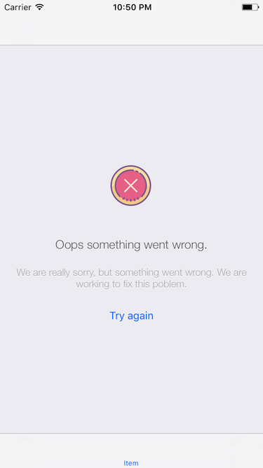

# StateController
UIViewController which implements switching states: Loading, No Data, Error and Content

| Loading state | Error state |
| --- | --- |
|  |  |

| Error state with retry | No data state |
| --- | --- |
|  |  |